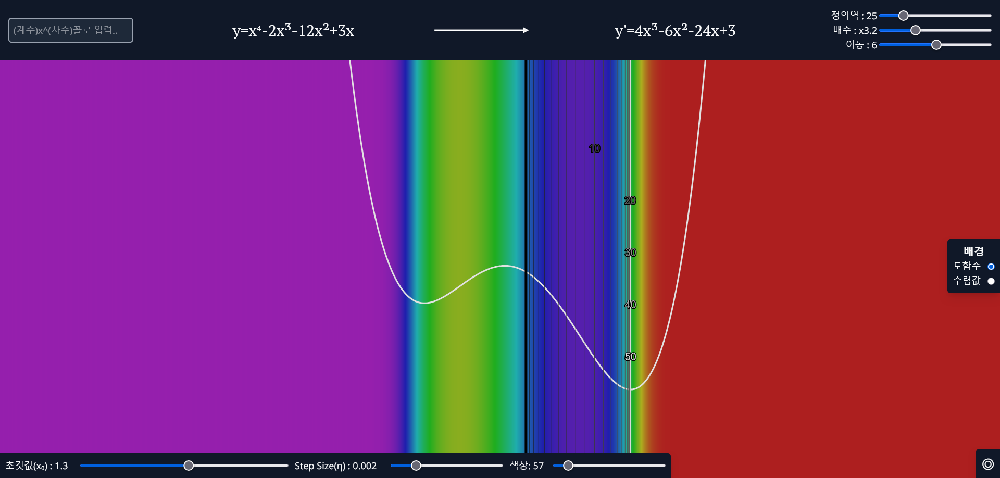

# mate - 경사 하강법을 이용한 다항함수의 극점 시각화

## 데모 페이지 >> [mate(Github Pages)](https://anter003.github.io/mate/)

20704 김성훈 수학 수행평가

```데스크탑 브라우저로 실행해 주세요. 모바일에서 실행 시 UI가 무너집니다.```

Made with `Svelte` & `p5.js`

---

## 사용 방법



### 좌상단 - 함수 입력

다항함수의 각 항을 `(계수)x^(차수)` 꼴로 입력해 주세요. (ex: `5x^3-2x+7`)

소수, 분수, 곱셈은 지원하지 않습니다.

### 상단 - 함수 표시

입력한 함수와 도함수가 표시됩니다.

### 우상단 - 함수 설정

`y = nf(x) + b`

**정의역** : 함수의 범위를 조절합니다.

**배수** : `n`, 함수 전체에 곱해지는 수입니다.

**이동** : `b`, 함수를 y 방향으로 평행이동합니다.

### 좌하단 - 경사하강법 설정

`xₙ₊₁ = xₙ - η * f'(xₙ)`

**초깃값(x₀)** : 경사하강법의 초깃값입니다. 화면에서 굵은 검은 선으로 표시됩니다.

**학습률(η)** : 경사하강법의 속도를 조절합니다. 값이 클수록 더 빠른 속도로 진행합니다.

**색상** : 색으로 맵핑할 함수값의 범위를 조절합니다. 값이 작을수록 함숫값 사이의 색의 구분이 명확해집니다.

### 화면 - 그래프

굵은 검은 선은 **초깃값(x₀)** 입니다. 경사하강법의 단계가 진행될수록 흰색에 가까운 선으로 표시됩니다. 10의 배수인 단계의 경우 숫자가 함께 표기됩니다.

### 우측 - 배경 설정

**도함수** : 도함수의 함숫값을 배경색으로 설정합니다. 값이 클수록 붉은색에, 값이 작을수록 보라색에 가까워지며 0 부근은 초록색으로 표시됩니다.

**수렴값** : x값(위치)에 따른 경사하강법의 수렴값을 배경색으로 설정합니다. 발산하는 경우 흰색으로 표시됩니다.

### 우하단 - 크레딧

링크를 클릭하면 이 페이지로 연결됩니다.
